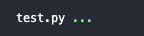

# DSCI-510 2023 Fall (32404D) Lab-9

Welcome to Lab 9! Please implement all the functions present in `lab9.py` and use the testing script provided to make sure your functions produce correct results. 

To install the dependencies, please run

`pip install -r requirements.txt`

In order to use the testing script, you need to have `pytest` installed in your Anaconda environment. You can run:

`pip install -U pytest`

Once you complete your function implementations, please test them by running the following command in your terminal: (Requires the terminal to be running from inside this directory)

`pytest test.py`

If your implementations are correct, the tests should run with no errors. Your output would look like this:

